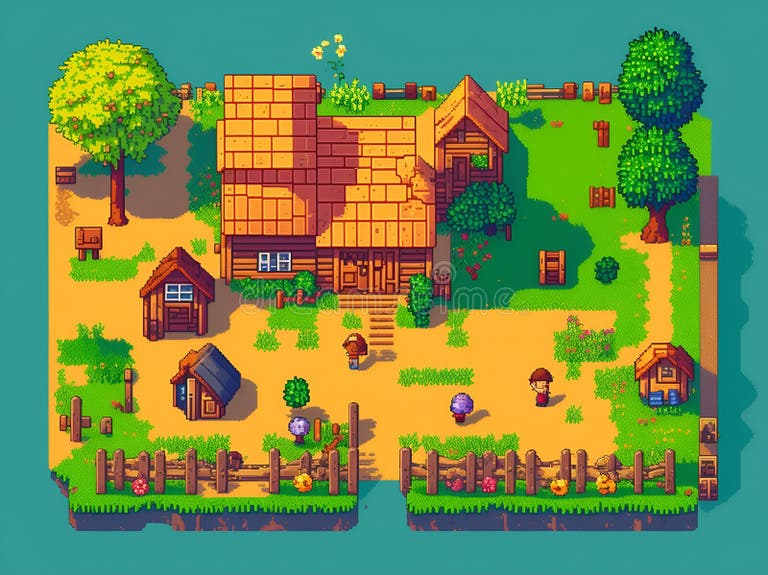

# 🕹️ 8-Bit Nostalgia Critique Game

> A playable deconstruction of retro gaming tropes and mechanics.

---

## Preview

*Experience the pixels, the challenge, and the commentary.*

  How to Play
Since this is a web-based experience, getting started is easy:
1. **Clone** this repository or download the ZIP.
2. Open **`index.html`** in any modern web browser (Chrome, Firefox, Edge).
3. Prepare for a trip back to the 8-bit era.

The Concept
This project isn't just a game; it's a **critique**. It explores the rose-tinted glasses we wear when looking back at the 8-bit era by highlighting:
* **Mechanical Limitations: How hardware constraints shaped gameplay.
* **Difficulty Scaling:A look at the "Nintendo Hard" phenomenon.
* *Visual Language: Using limited palettes to convey complex worlds.

##  Built With
* HTML5- The core structure.
* inline CSS- For that authentic retro styling.

File Structure
* `index.html`: The main entry point.
* `8bit.jpg` & `image.jpg`: Assets used for environmental storytelling.
* `game.jpg`: Promotional and UI elements.

---
Created with  by [haymi2000](https://github.com/haymi2000)
